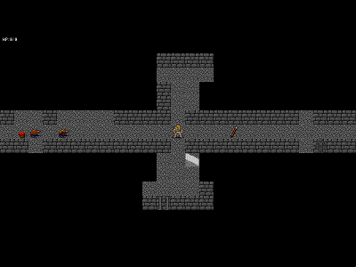
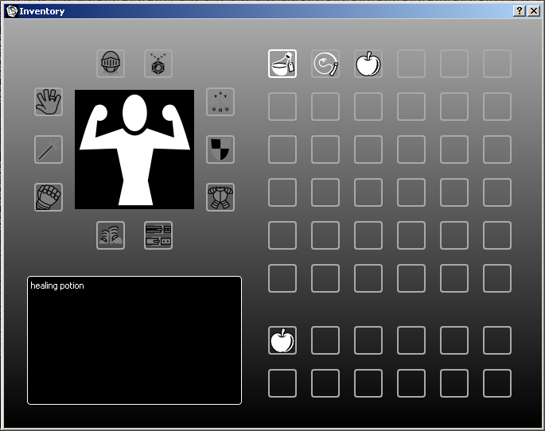
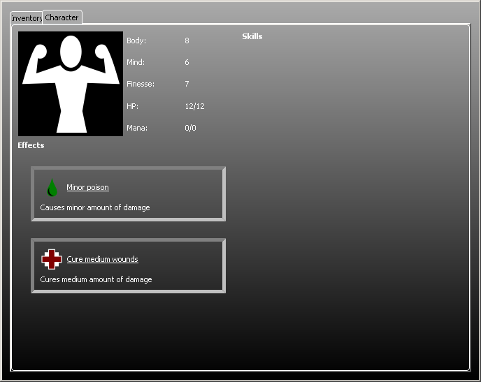

########
Commands
########

*************
Main controls
*************
The game has been designed to be played with keyboard or with joypad with help
of correct tools. Buttons used to control the game are:

 * move: |directions|, keypad, cursor keys, vi keys
 * action a: |action_a|, space, z, keypad 5
 * action b: |action_b|, control, x
 * wait: |back|, q
 * menu: |start|, return
 * switch to sub menu left: |lb|, insert, page up, q
 * switch to sub menu right: |rb|, delete, page down, w
 * attack: |rt|, control

.. hint:: a tool like Xpadder_ enables you to use joypad for playing, thus
   making the game more enjoyable.
 
*******************
Starting a new game
*******************
When the game starts, the character selection screen is shown. Use 
|directions| to scroll through different characters and |action_a| to select 
your character.

**************
Main interface
**************
Player character is shown in the middle of the screen with the dungeon shown
surrounding him. Items and monsters are also shown on this area.

At the top portio of the screen amount of hit points and mana are being shown.
Next to them are icons of currently active effects (poisoning and healing in
this case).

Bottom of the screen is reserved for the battle log, which can be used to check
details of previous actions.

Player can move in eight directions using |directions| and descent or ascent 
stairs by using |action_a|.

----------------
Picking up items
----------------
Easiest way to pick up an item is to walk on top of it and press |action_a| to
pick it up. If there are multiple items, player can either pick them up one
by one or open inventory page with |start| and use it to manipulate items.

-----------------
Attacking enemies
-----------------
Character automatically attacks an enemy if player tries to enter same location
where the enemy is. For close combat you do not need weapon, although having
one can make quite a difference.

For ranged attack you need to have a weapon and suitable ammunition for it.
Attack enemies in distance by pressing |rt| and |directions| together.

*******
Waiting
*******
Sometimes it is better to wait the monsters to move out of your way and sneak
past them than to attack them headlong. Press |back| to wait for a little bit.

****
Menu
****
Menu can be opened by pressing |start|. This will bring up a multipage menu.
Player can change pages by pressing |lb| or |rb|.

---------
Inventory
---------
Iventory window shows items on the ground, carried items and items in use at
the same time.

Inventory is accessible from menu. In inventory window, move selector around by
using |directions|. |action_a| will use an item if it is in your invetory or pick it
up if it is on ground.

|action_b| is used to drop items on to ground.

----------------
Player character
----------------
Details of the player character are shown on a separate page of menu (accessed
with |rb|).

Top of the screen shows his current statistics: body, mind, finesse, hit points
and mana. Below of them are details of currently active effects.

.. _Xpadder: http://www.xpadder.com/

.. |action_a| image:: images/action_a.png
              :alt: Action A
.. |action_b| image:: images/action_b.png
              :alt: Action B

.. |rt| image:: images/right_trigger.png
        :alt: Right Trigger
.. |lb| image:: images/left_bumber.png
        :alt: Left Bumber
.. |rb| image:: images/right_bumber.png
        :alt: Right Bumber

.. |back| image:: images/back.png
          :alt: Wait

